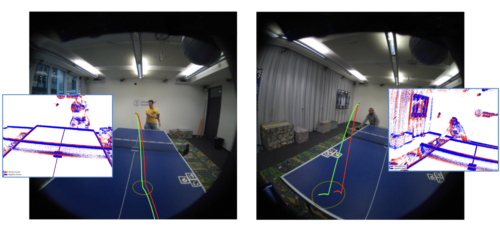

# Egocentric Event-Based Vision for Ping Pong Ball Trajectory Prediction

This repository contains the official code for the paper **Egocentric Event-Based Vision for Ping Pong Ball Trajectory Prediction**  ([arXiv:2506.07860](https://arxiv.org/abs/2506.07860)). This paper has been accepted for publication at the IEEE Computer Vision and Pattern Recognition Workshop (CVPRW), Nashville, 2025. ©IEEE

---

## 📝 Project Overview

In this work, we present a real-time egocentric trajectory prediction system for table tennis using event cameras. Unlike standard cameras, which suffer from high latency and motion blur at fast ball speeds, event cameras provide higher temporal resolution, enabling more frequent state updates, greater robustness to outliers, and accurate trajectory predictions using just a short time window after the opponent’s impact. This is the first framework for egocentric table-tennis ball trajectory prediction using event cameras.

<p align="center">
  
</p>

---

## 🛠️ Setup Instructions

Follow these steps to set up the environment and run the project.

## 📦 Requirements

- Python 3.8 installed  
- Git (optional, for cloning the project)

### 1. Clone the Repository *(or download the code)*

```bash
git clone https://github.com/uzh-rpg/event_based_ping_pong_ball_trajectory_prediction.git
cd event_based_ping_pong_ball_trajectory_prediction
```

Or download the ZIP and extract it.

### 2. Create a Virtual Environment

```bash
python3.8 -m venv venv
```

### 3. Activate the Virtual Environment

- **Linux/macOS**:
  ```bash
  source venv/bin/activate
  ```

- **Windows**:
  ```bash
  venv\Scripts\activate
  ```

### 4. Install Dependencies

Make sure you're in the same directory as `requirements.txt`:

```bash
pip install -r requirements.txt
```
### 5. Run the Project

There is an example sequence provided in `data/test_sequence_1.zip`.  
Extract the ZIP file first, then run the main pipeline on the extracted sequence:

```bash
python3.8 ./perception_pipeline_ball.py ./data/test_sequence_1
```

For every sequence, there is a `config.yml` file inside the sequence folder.  
You can change parameters and settings for your experiments by editing this config file.